# Two-Tier AWS Infrastructure with Terraform — Teslo Shop

A security-conscious, two-tier architecture on AWS, provisioned entirely with Terraform, hosting a real NestJS + PostgreSQL e-commerce API. **v2** adds a CloudFront CDN in front of the ALB and replaces the single EC2 instance with an Auto Scaling Group — verified live with real CPU load, not just deployed and left alone.


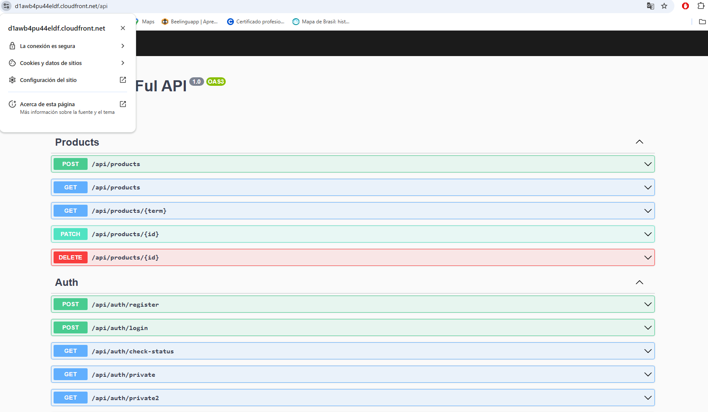

---

## Table of Contents

- [Overview](#overview)
- [Architecture](#architecture)
- [Application](#application)
- [Design Decisions](#design-decisions)
- [Infrastructure as Code](#infrastructure-as-code)
- [CI/CD](#cicd)
- [Getting Started](#getting-started)
- [Deployment](#deployment)
- [Verification](#verification)
- [CloudFront](#cloudfront)
- [Auto Scaling — Verified Behaviors](#auto-scaling--verified-behaviors)
- [Debugging Log](#debugging-log)
- [Cost](#cost)
- [Simplifications vs. Full Reference Architecture](#simplifications-vs-full-reference-architecture)
- [Future Improvements](#future-improvements)
- [Lessons Learned](#lessons-learned)

---

## Overview

This project provisions a two-tier AWS architecture — a public tier for internet-facing traffic and a private tier for the application and database — to host **Teslo Shop**, a NestJS + TypeORM + PostgreSQL e-commerce API originally built during Fernando Herrera's Udemy Docker course.

**v2** evolves the compute tier from a single fixed EC2 instance into an **Auto Scaling Group** behind the existing ALB, and adds a **CloudFront** distribution in front of it for HTTPS at the edge. Both were deployed, load-tested, and torn down against a real AWS account — see [Auto Scaling — Verified Behaviors](#auto-scaling--verified-behaviors) for the evidence.

**Stack:** Terraform · AWS (VPC, EC2, Auto Scaling, RDS, ALB, CloudFront, IAM/SSM, CloudWatch) · Docker · NestJS · TypeORM · PostgreSQL · GitHub Actions

This is a simplified version of [project #11](https://github.com/NotHarshhaa/DevOps-Projects) from NotHarshhaa's DevOps-Projects repo, rebuilt from scratch and deployed end-to-end on a real AWS account — see the [Debugging Log](#debugging-log) for the actual issues found and fixed along the way, in both v1 and v2.

---

## Architecture

- 1 VPC across 2 Availability Zones (`10.0.0.0/16`)
- 2 public subnets (ALB) + 2 private subnets (Auto Scaling Group, RDS)
- 1 Internet Gateway + 1 NAT Gateway
- 1 **CloudFront distribution** in front of the ALB — HTTPS to the client via CloudFront's default certificate, HTTP from CloudFront to the ALB
- Layered Security Groups: `Internet → ALB (80/443) → EC2 (from ALB only) → RDS (from EC2 only, port 5432)`
- 1 **Auto Scaling Group** (`min 1 / max 2`, `t3.micro`) running the app in Docker, private subnets, **no public IP** — replaces v1's single fixed EC2 instance
- A **target-tracking scaling policy** on average CPU (target 50%) — scales out under load, scales back in once load drops
- 1 RDS PostgreSQL 16 (`db.t3.micro`), encrypted at rest, **not publicly accessible**, private subnet
- 1 Application Load Balancer, public subnet
- **29 AWS resources total** (27 from v1, minus the single EC2 instance and its target group attachment, plus CloudFront, the Launch Template, the Auto Scaling Group, and the scaling policy) — matches the 29 resources actually destroyed at teardown, see [Cost](#cost)


**Security group chain, verified:**

| ALB — open to internet | EC2 — only from ALB | RDS — only from EC2 |
|---|---|---|
|  |  |  |

---

## Application

**Teslo Shop** is a REST API e-commerce backend (NestJS + TypeORM) built during Fernando Herrera's Udemy course. Chosen over the course's other Docker exercise (`docker-graphql`) specifically because it uses a real relational database — giving the RDS instance in this architecture an actual purpose to validate, rather than sitting idle.

- Docker image: [`diegoleon1982/teslo-shop:latest`](https://hub.docker.com/r/diegoleon1982/teslo-shop)
- Environment variables injected dynamically by Terraform via the Launch Template's `user_data`: `DB_HOST`, `DB_PORT`, `DB_NAME`, `DB_USERNAME`, `DB_PASSWORD`, `JWT_SECRET`, `STAGE`, `PORT`
- Container maps host port `80` to container port `3000` (`docker run -p 80:3000`) — the Target Group and CloudFront both talk to port 80; the app itself only knows about port 3000
- API prefix: `/api` (Swagger docs served at `/api`)
- SSL to RDS is enabled automatically in the app when `STAGE=prod`

---

## Design Decisions

**Why EC2 and RDS in private subnets, with no public IP?**
The ALB is the only public entry point (fronted now by CloudFront as an additional edge layer). This limits the attack surface: even if the ALB's security group were misconfigured, the app servers and database still aren't directly reachable from the internet. Confirmed by trying to connect to RDS directly from a local DB client — connection refused, as expected for a resource with no public accessibility.

**Why SSM Session Manager instead of SSH?**
No public IP, no key pair, no port 22 open anywhere. An IAM instance profile with `AmazonSSMManagedInstanceCore` lets me connect through the AWS Console/CLI without opening SSH or managing keys. This turned out to be essential — every bug in this project, in both v1 and v2, was diagnosed live, in production, through an SSM session.

**Why layered Security Groups instead of one shared SG?**
Each tier only accepts traffic from the specific SG in front of it (ALB → EC2 → RDS), not from CIDR ranges. A compromised EC2 instance can't be used to probe RDS from just any private IP — only through this exact chain. Screenshots above confirm the RDS SG's only inbound rule sources from the EC2 SG, not `0.0.0.0/0`.

**Why an Auto Scaling Group instead of just adding a second fixed EC2 instance?**
A second fixed instance solves capacity but not resilience — if one dies, it stays dead until someone notices. An ASG with an ELB-based health check replaces unhealthy instances automatically, and a target-tracking policy adds/removes capacity based on real CPU load, not a guess made at `terraform apply` time. All three behaviors are demonstrated with real evidence below, not just declared in code.

**Why CloudFront with `origin_protocol_policy = "http-only"` instead of HTTPS all the way to the ALB?**
The ALB listener in this project only has an HTTP (port 80) listener — provisioning a matching TLS certificate and listener on the ALB itself was scoped out for v3 (see [Future Improvements](#future-improvements)). CloudFront terminates HTTPS at the edge using its default `*.cloudfront.net` certificate (free, no DNS setup required), which is enough to serve the app over HTTPS to the client. The CloudFront-to-ALB hop stays on the private AWS backbone, not the public internet.

---

## Infrastructure as Code

The Terraform code is split by resource domain rather than kept in a single file — easier to navigate as the project grows, and closer to how larger real-world Terraform codebases are organized:

```
terraform/
├── provider.tf                  # AWS provider configuration (us-east-1, credentials via environment)
├── variables.tf                  # Input variables with sensible defaults
├── outputs.tf                     # ALB DNS name, CloudFront domain, ASG name, RDS endpoint, etc.
├── network.tf                      # VPC, subnets, Internet Gateway, NAT Gateway, route tables
├── security-groups.tf               # 3 layered Security Groups (ALB, Web, DB)
├── iam.tf                            # IAM role + instance profile for SSM
├── ec2.tf                             # (v1) EC2 instance + user_data — replaced by asg.tf in v2
├── asg.tf                             # Launch Template + Auto Scaling Group + target-tracking scaling policy
├── cloudfront.tf                       # CloudFront distribution in front of the ALB
├── rds.tf                              # RDS PostgreSQL instance + DB subnet group
├── alb.tf                               # Load balancer, target group, listener
└── terraform.tfvars.example              # Copy to terraform.tfvars and fill in your own secrets
```

| Category | Resources |
|---|---|
| Networking | VPC, 4 subnets, IGW, NAT Gateway + EIP, 2 route tables + 4 associations |
| Security | 3 Security Groups (ALB, Web, DB) |
| Compute | Launch Template, Auto Scaling Group, target-tracking scaling policy, IAM role + instance profile (SSM) |
| Database | 1 RDS PostgreSQL instance, DB subnet group |
| Load Balancing | ALB, target group, listener |
| Edge / CDN | 1 CloudFront distribution |

---

## CI/CD

The GitHub Actions workflow (`.github/workflows/terraform.yml`) has two jobs:

**`plan`** — runs automatically on every push to `main`: `terraform fmt`, `terraform init`, `terraform validate`, `terraform plan`. Read-only, no infrastructure changes, no cost.

**`apply_or_destroy`** *(v2, manually triggered only)* — a `workflow_dispatch` job with an `action` input (`apply` or `destroy`). It never runs on a push; it only runs when explicitly triggered from the GitHub Actions tab, which keeps a human in the loop before any destructive action — the same principle that keeps `plan` and `apply` separate in the first job.

- AWS credentials and sensitive Terraform variables (`db_password`, `jwt_secret`) are stored as **GitHub Secrets** — never committed to the repo, never visible in logs.
- The workflow runs on GitHub-hosted runners, so it needs no local machine or persistent credentials file.

**Workflow run, manually triggered via `workflow_dispatch`:**
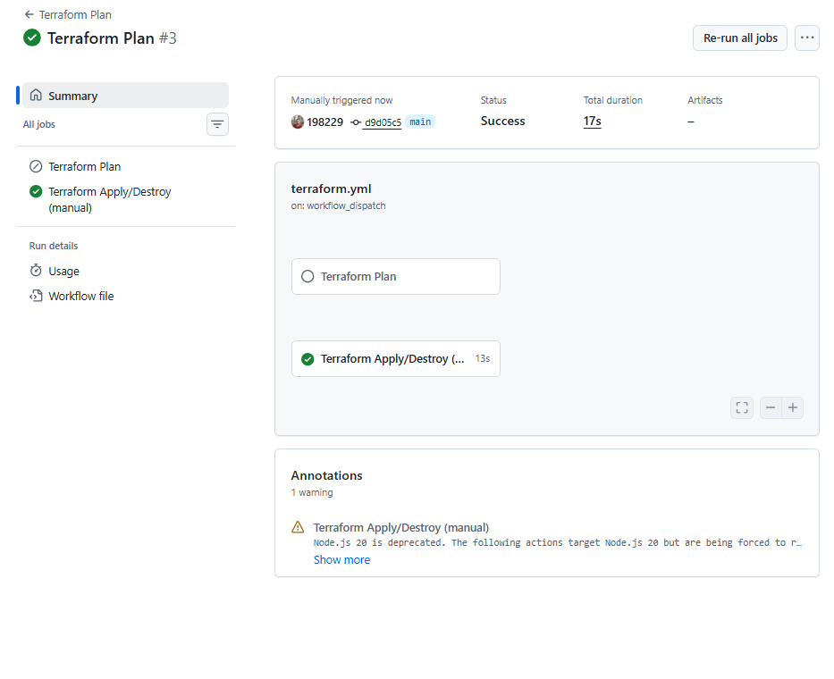

**Plan output, generated entirely by the pipeline (v1):**


> This `workflow_dispatch` job surfaced a real gap in the setup — see [Debugging Log #6](#6-workflow_dispatch-destroy-reported-success-but-destroyed-nothing) below.

---

## Getting Started

Want to deploy this yourself? Here's everything you need.

### Prerequisites

- An AWS account with billing enabled
- [Terraform](https://developer.hashicorp.com/terraform/install) >= 1.5
- [AWS CLI](https://aws.amazon.com/cli/) installed and configured with credentials that have permissions to create VPCs, EC2, Auto Scaling, RDS, ALB, CloudFront, and IAM resources (an IAM user with `AdministratorAccess` is the simplest option for testing)

### Setup

1. **Clone the repo:**
   ```bash
   git clone https://github.com/198229/Teslo-two-tier-aws-terraform.git
   cd Teslo-two-tier-aws-terraform/terraform
   ```

2. **Configure AWS credentials as environment variables** (the provider reads from the environment, not a hardcoded profile):
   ```bash
   # macOS/Linux
   export AWS_ACCESS_KEY_ID="your-access-key"
   export AWS_SECRET_ACCESS_KEY="your-secret-key"
   export AWS_DEFAULT_REGION="us-east-1"
   ```
   ```powershell
   # Windows PowerShell
   $env:AWS_ACCESS_KEY_ID="your-access-key"
   $env:AWS_SECRET_ACCESS_KEY="your-secret-key"
   $env:AWS_DEFAULT_REGION="us-east-1"
   ```
   Alternatively, if you already have a named profile configured via `aws configure --profile <name>`, export `AWS_PROFILE=<name>` instead of individual keys.

3. **Copy the example variables file and fill in your own values:**
   ```bash
   cp terraform.tfvars.example terraform.tfvars
   ```
   Edit `terraform.tfvars` and set your own `db_password` and `jwt_secret` — never reuse the example values.

4. **Initialize and deploy:**
   ```bash
   terraform init
   terraform validate
   terraform plan
   terraform apply
   ```
   Confirm with `yes` when prompted. RDS typically takes 5–10 minutes to provision, and CloudFront can take 10–15 minutes to fully deploy — both are expected.

5. **Grab the outputs** once `apply` finishes:
   ```bash
   terraform output
   ```
   Open `https://<cloudfront_domain_name>/api` in your browser to see the Swagger UI over HTTPS.

6. **When you're done, tear it down** to avoid ongoing charges:
   ```bash
   terraform destroy
   ```
   Run this from the same machine/state where you ran `apply` — see [Debugging Log #6](#6-workflow_dispatch-destroy-reported-success-but-destroyed-nothing) for why this matters.

### Debugging a running deployment

Instances have no SSH access by design. To inspect logs or troubleshoot, connect via **SSM Session Manager** (make sure the AWS CLI is authenticated, per step 2 above, and the [Session Manager plugin](https://docs.aws.amazon.com/systems-manager/latest/userguide/session-manager-working-with-install-plugin.html) is installed locally):

```bash
aws autoscaling describe-auto-scaling-groups --auto-scaling-group-names teslo-two-tier-asg
aws ssm start-session --target <instance_id_from_above>
```

Once connected:
```bash
sudo docker logs teslo-shop-app --tail 50
```

---

## Deployment

```bash
terraform init
terraform validate
terraform plan
terraform apply
```


**v1 outputs:**
```
alb_dns_name    = teslo-two-tier-alb-1863207417.us-east-1.elb.amazonaws.com
ec2_instance_id = i-08fada569e2714f24
ec2_private_ip  = 10.0.11.233
rds_endpoint    = teslo-two-tier-rds.cy1ayiiig6z7.us-east-1.rds.amazonaws.com
rds_port        = 5432
vpc_id          = vpc-0078239731a3d034a
```

**v2 outputs** (`ec2_instance_id` / `ec2_private_ip` were removed — instances are now dynamic, managed by the ASG):
```
alb_dns_name           = teslo-two-tier-alb-1068367461.us-east-1.elb.amazonaws.com
asg_name                = teslo-two-tier-asg
cloudfront_domain_name = d1awb4pu44eldf.cloudfront.net
launch_template_id     = lt-0eb26a73a8582cba9
rds_endpoint            = teslo-two-tier-rds.cy1ayiiig6z7.us-east-1.rds.amazonaws.com
rds_port                = 5432
vpc_id                  = vpc-05a6dbe2e1c7a1477
```


---

## Verification

**EC2 running, no public IP, in the private subnet (v1 baseline):**


**RDS: available, encrypted, not publicly accessible:**
| Connectivity | Encryption |
|---|---|
|  |  |

**ALB Target Group: EC2 registered and healthy** — confirms the health check on `/api` is working correctly:


**App reachable through the ALB, serving real seeded data:**


**Direct psql connection from inside the private network, over SSL, confirming TypeORM's `synchronize: true` auto-created the schema:**


---

## CloudFront

CloudFront sits in front of the ALB, terminating HTTPS at the edge with its default certificate:

**Distribution deployed and enabled:**
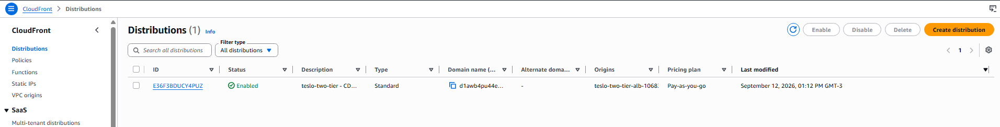

**Swagger UI, loaded through the CloudFront domain over HTTPS** (padlock visible in the browser, origin is the ALB behind it):


**5 consecutive requests through CloudFront, all returning `200`:**
```powershell
for ($i=1; $i -le 5; $i++) { (Invoke-WebRequest -Uri "https://d1awb4pu44eldf.cloudfront.net/api" -UseBasicParsing).StatusCode }
```
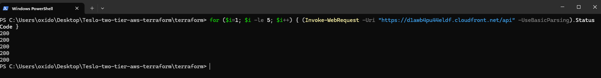

---

## Auto Scaling — Verified Behaviors

The Auto Scaling Group's three behaviors were each triggered and observed against the real, deployed infrastructure — not assumed from the Terraform code.

**1. Self-healing** — an instance was terminated manually (`aws ec2 terminate-instances`) to simulate a real failure. The ASG detected the ELB health check failure and replaced it automatically.

**2. Scale-out under real CPU load** — connected to the running instance via SSM and saturated both vCPUs with `for i in 1..4; do (yes > /dev/null &); done`. CloudWatch picked up the spike, the `AlarmHigh` target-tracking alarm fired, and the ASG launched a second instance.

**3. Scale-in once load dropped** — killed the load (`pkill yes`), waited for CloudWatch's `AlarmLow` alarm to confirm sustained low CPU, and watched the ASG terminate the extra instance and return to the desired capacity of 1.

**All three events, in AWS's own words, in the Activity History:**
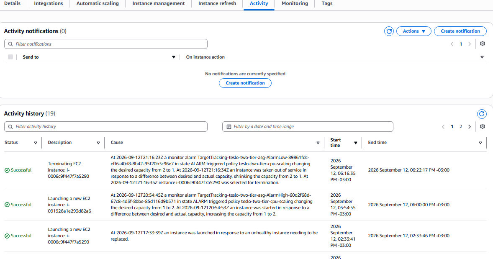

**The real CPU spike that triggered the scale-out, as seen in CloudWatch:**
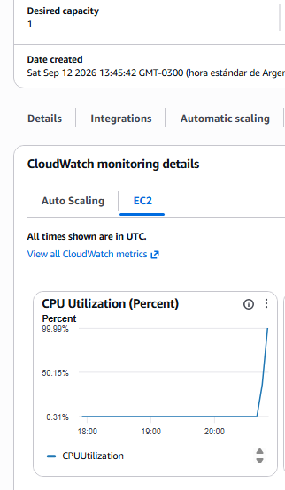

**Stabilized back to desired capacity after the full cycle:**
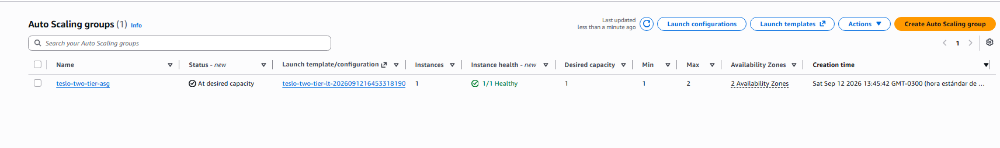

---

## Debugging Log

Everything below was found and fixed against the real, deployed infrastructure — not simulated. This is the part of the project I'd point to first in an interview.

### 1. `GroupDescription` rejected mid-apply: non-ASCII characters
`terraform plan` passed cleanly, but `terraform apply` failed **after** the NAT Gateway and ALB were already created:


AWS's `CreateSecurityGroup` API rejects accented characters in `GroupDescription`. My original description had a `í` in *"tráfico"*. Fixed by using plain ASCII (`"Permite trafico..."`). Lesson: some validation only happens against the live AWS API, not during `plan`.

### 2. `key_name = ""` broke instance creation
Passing an empty string for `key_name` is not the same as omitting it — AWS tries to look up a key pair literally named `""` and fails. Since this project uses SSM Session Manager exclusively, the fix was to remove the `key_name` argument entirely rather than pass an empty value.

### 3. NestJS module version mismatch (`@nestjs/websockets` vs `@nestjs/core`)
The app crashed on boot with:
```
TypeError: this.metadataScanner.getAllMethodNames is not a function
```
`@nestjs/common`, `@nestjs/core`, and `@nestjs/platform-express` were pinned to `^8.0.0` while `@nestjs/websockets`, `@nestjs/typeorm`, `@nestjs/jwt`, and others were on `^9.0.0`. The WebSockets module called an API from a `MetadataScanner` version the pinned core didn't have. **Fixed by aligning the whole NestJS core to `^9.0.0`.**

### 4. TypeORM 0.3.x blocks unconditional `DELETE` — even the `.where('1=1')` workaround
The `/api/seed` endpoint returned `500`, with this in the container logs (read live via SSM):
```
TypeORMError: Empty criteria(s) are not allowed for the delete operation.
```
The seed logic used `.delete().where({}).execute()` to clear tables before reseeding — valid in TypeORM 0.2.x, rejected in 0.3.x. My first fix, `.where('1=1')`, *also* failed with the same error. Reading TypeORM's own source directly inside the running container settled it:
```bash
sudo docker exec teslo-shop-app grep -rn "Empty criteria" /app/node_modules/typeorm/
```
This version of TypeORM explicitly detects and blocks the `"1=1"` trick — it checks the built WHERE expression, not just whether `.where()` was called. The library's own error message spelled out the real fix: *"build the query without one to intentionally affect all rows."* Removing `.where(...)` entirely resolved it.


### 5. Auto Scaling Group stuck in a replace loop — `health_check_grace_period` too short
Right after switching from a fixed EC2 instance to the ASG, instances kept cycling: launched, marked unhealthy, terminated, replaced — repeatedly, without ever stabilizing. The Target Group showed multiple instances churning through `unhealthy` → `draining` in quick succession:

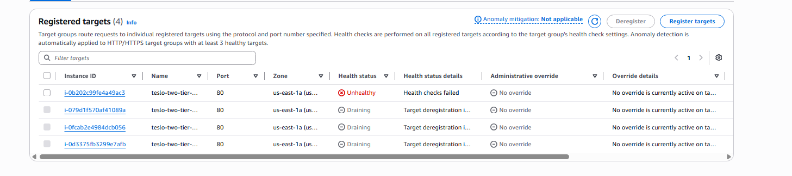

The ASG's Activity History told the real story — 17+ events in a few minutes, every one caused by *"an ELB system health check failure"*:

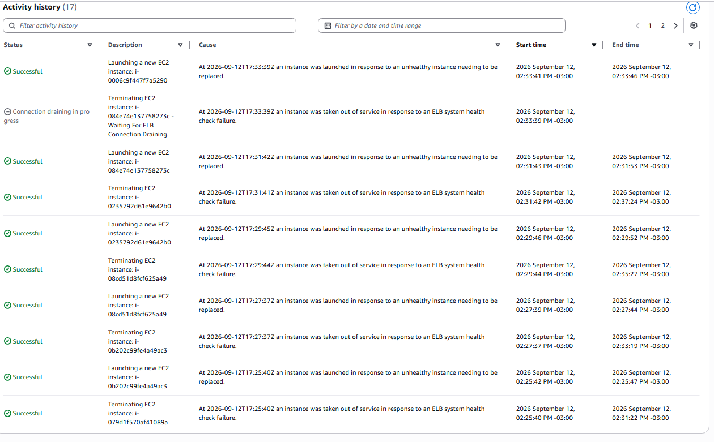

The cause: `health_check_grace_period` was set to `90` seconds. The instance's `user_data` runs `yum update`, installs Docker, pulls the image, and then **actively polls RDS for up to 5 minutes** before starting the container — a legitimate, necessary wait from v1. At 90 seconds, the ASG started evaluating the ELB health check before the app had even started, judged the instance unhealthy, and replaced it — restarting the same slow boot sequence on the replacement, which hit the same 90-second wall. **Fixed by raising `health_check_grace_period` to `400` seconds**, giving the full boot sequence room to finish before health checks begin. After the fix, the next instance launched, passed its health check on the first try, and the ASG settled at the desired capacity.

### 6. `workflow_dispatch` destroy reported success but destroyed nothing
After verifying the ASG's scaling behaviors, I used the new `workflow_dispatch` job to run `terraform destroy` — the response looked completely clean:
```
Either you have not created any objects yet or the existing objects were
already deleted outside of Terraform.
Destroy complete! Resources: 0 destroyed.
```
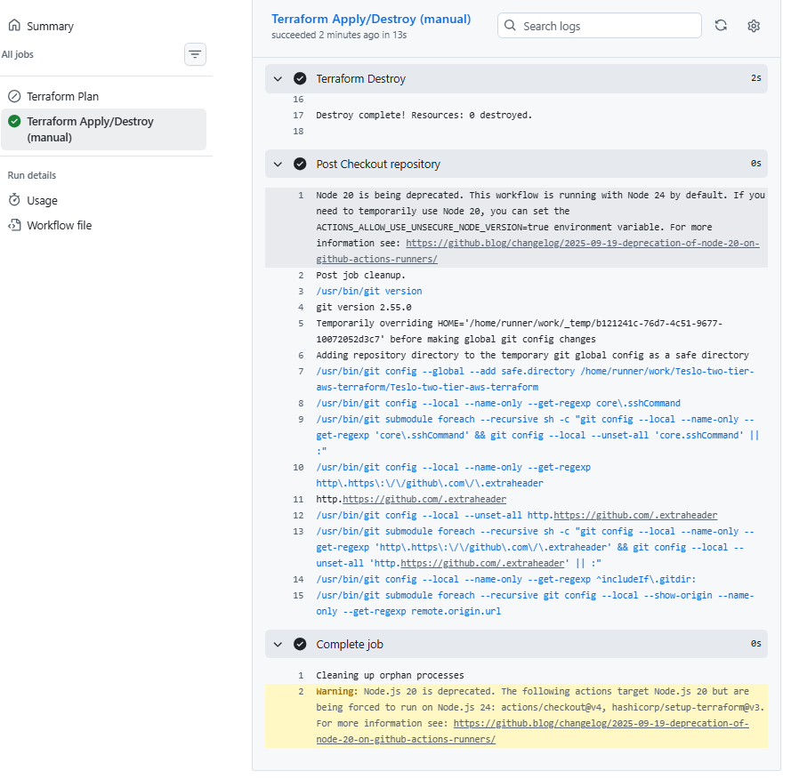

Except the real infrastructure — VPC, ASG, RDS, CloudFront, all 29 resources — was still live in AWS. The project has no remote backend configured (`provider.tf` uses local state), so every environment that runs Terraform has its own isolated `terraform.tfstate`. My local machine's state file knew about the 29 resources it had created; the GitHub Actions runner, checking out a fresh copy of the repo with no state file of its own, had nothing to destroy and correctly (from *its* point of view) reported zero changes. **Fixed by running `terraform destroy` from the same local machine that held the real state** — confirmed 29 resources destroyed, then independently re-verified with `aws rds describe-db-instances`, `aws ec2 describe-instances`, `aws elbv2 describe-load-balancers`, `aws cloudfront list-distributions`, and `aws autoscaling describe-auto-scaling-groups`, all returning empty.

This is the practical, first-hand reason a **remote backend (S3 + DynamoDB lock)** is table stakes for using `workflow_dispatch` safely in any team setting — see [Future Improvements](#future-improvements).

---

## Cost

This project is designed to run for a few hours at a time and then be destroyed — not left running.

| Resource | Approx. hourly cost |
|---|---|
| EC2 t3.micro (×1–2, Auto Scaling) | ~$0.0104/hr each |
| RDS db.t3.micro | ~$0.017/hr |
| NAT Gateway | ~$0.045/hr + data processing |
| ALB | ~$0.0225/hr + LCU |
| CloudFront | Free tier: 1 TB transfer + 10M requests/month |

**v1 actual cost of a full test cycle (apply → verify → seed → destroy):**


**v2 actual cost, including the full day of building, debugging, and load-testing the ASG (multiple apply/destroy cycles, the grace-period replace loop, and sustained CPU load to trigger scaling):**
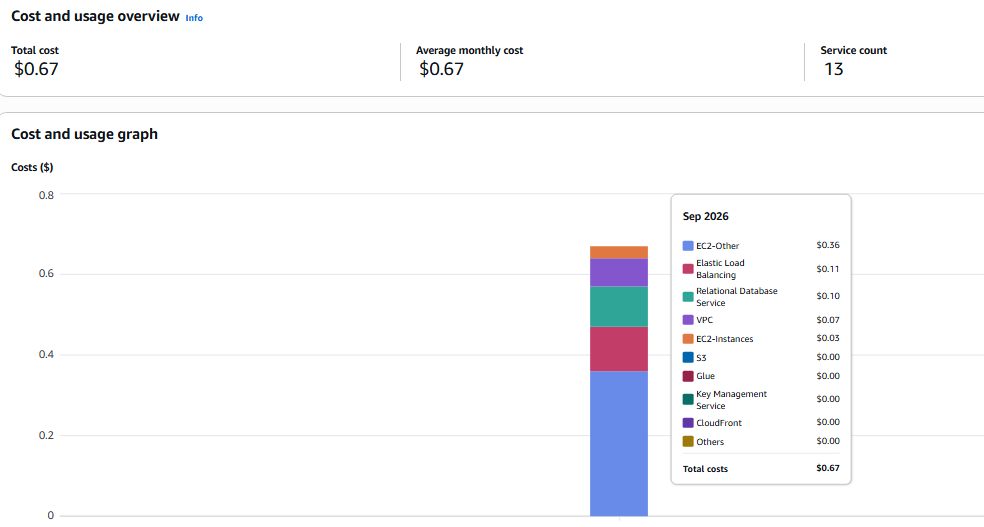

```bash
terraform destroy
```

**v1 destroy** (27 resources — before CloudFront/ASG existed):


**v2 destroy** (29 resources, matching the 29 created):
```
Destroy complete! Resources: 29 destroyed.
```
Independently re-verified empty with `aws rds describe-db-instances`, `aws ec2 describe-instances`, `aws elbv2 describe-load-balancers`, `aws cloudfront list-distributions`, and `aws autoscaling describe-auto-scaling-groups` — see [Debugging Log #6](#6-workflow_dispatch-destroy-reported-success-but-destroyed-nothing) for why that independent check mattered.

---

## Simplifications vs. Full Reference Architecture

This project is a simplified version of [project #11](https://github.com/NotHarshhaa/DevOps-Projects) from NotHarshhaa's DevOps-Projects repo. v2 closes two of the original gaps; the rest remain deliberate scope decisions:

| Full reference architecture | This project (v2) |
|---|---|
| ~~Auto Scaling Group~~ | ✅ Implemented — see [Auto Scaling — Verified Behaviors](#auto-scaling--verified-behaviors) |
| ~~CloudFront~~ | ✅ Implemented — see [CloudFront](#cloudfront) |
| HTTPS end-to-end (ACM + custom domain) | CloudFront default cert only; ALB stays HTTP |
| Multi-AZ RDS | Single-AZ RDS |
| WAF | None |
| Likely ECR | Docker Hub |

---

## Future Improvements

- [x] Manually-triggered (`workflow_dispatch`) GitHub Actions job for `terraform apply` / `terraform destroy` — done, see [CI/CD](#cicd)
- [x] v2: Auto Scaling Group across multiple instances — done, see [Auto Scaling — Verified Behaviors](#auto-scaling--verified-behaviors)
- [x] v2: CloudFront distribution in front of the ALB — done, see [CloudFront](#cloudfront)
- [ ] **Migrate Terraform state to a remote backend (S3 + DynamoDB lock)** — not optional if `workflow_dispatch` is going to be used safely; see [Debugging Log #6](#6-workflow_dispatch-destroy-reported-success-but-destroyed-nothing) for the real failure this caused
- [ ] HTTPS end-to-end: ACM certificate + custom domain via Route 53, HTTPS listener on the ALB, CloudFront origin over HTTPS instead of HTTP
- [ ] AWS WAF, attached to CloudFront or the ALB
- [ ] Migrate the app image from Docker Hub to Amazon ECR
- [ ] Add a separate CI/CD pipeline to build and push the Teslo Shop Docker image automatically on every app commit
- [ ] Move secrets (`DB_PASSWORD`, `JWT_SECRET`) out of EC2 `user_data` and into AWS Secrets Manager, fetched by the container at startup instead of injected as plaintext env vars
- [ ] Add a `wait-for-it` style healthcheck directly in the Dockerfile `HEALTHCHECK` instruction
- [ ] Multi-AZ RDS

---

## Lessons Learned

- **`terraform plan` doesn't catch everything.** The ASCII character issue only surfaced mid-`apply`, after real (billable) resources had already been created. Always budget time for apply-time failures, not just plan-time ones.
- **Version pinning across a framework's own sub-packages matters as much as pinning the framework itself.** The NestJS websockets crash wasn't caused by an outdated dependency in the traditional sense — every package was a "valid" semver range, they just didn't agree with each other.
- **When a library's error message tells you the fix, trust it literally before getting clever.** My first instinct (`.where('1=1')`) was a workaround for the symptom; the actual library had already anticipated that exact workaround and blocked it. Reading the dependency's source directly, inside the running container, resolved it faster than more trial and error would have.
- **SSM Session Manager isn't just a "nice to have" for a private-subnet EC2 — it's how every one of these bugs actually got diagnosed**, live, with real logs, without ever opening port 22.
- **A health check grace period isn't a formality — it has to be longer than your actual boot sequence, worst case included.** Tuning it against the happy path (a fast RDS connection) rather than the documented worst case (a 5-minute wait loop) is what caused the replace loop in Debugging Log #5.
- **Local Terraform state is invisible to anything that isn't the exact machine that created it.** A `destroy` that reports success from an environment with no state for your resources isn't lying — it's technically correct and dangerously misleading at the same time. This is the concrete, first-hand argument for a remote backend, not just a best-practice bullet point read somewhere.
- **Verify destruction independently of the tool that claims to have done it.** After the local `terraform destroy`, I cross-checked with five separate `aws describe-*` / `list-*` CLI calls across RDS, EC2, ELB, CloudFront, and Auto Scaling — not because I distrusted the "29 destroyed" message, but because trusting a single source after already being burned once by a false "success" is how the AWS bill surprises happen.

---

## Tech Stack

`Terraform` `AWS` `Auto Scaling` `CloudFront` `CloudWatch` `Docker` `NestJS` `TypeORM` `PostgreSQL` `VPC` `EC2` `RDS` `ALB` `IAM` `SSM` `GitHub Actions`
