# Two-Tier AWS Infrastructure with Terraform — Teslo Shop

A security-conscious, two-tier architecture on AWS, provisioned entirely with Terraform, hosting a real NestJS + PostgreSQL e-commerce API. Deployed, tested, and torn down for a total AWS cost of **$0.12 USD**
.
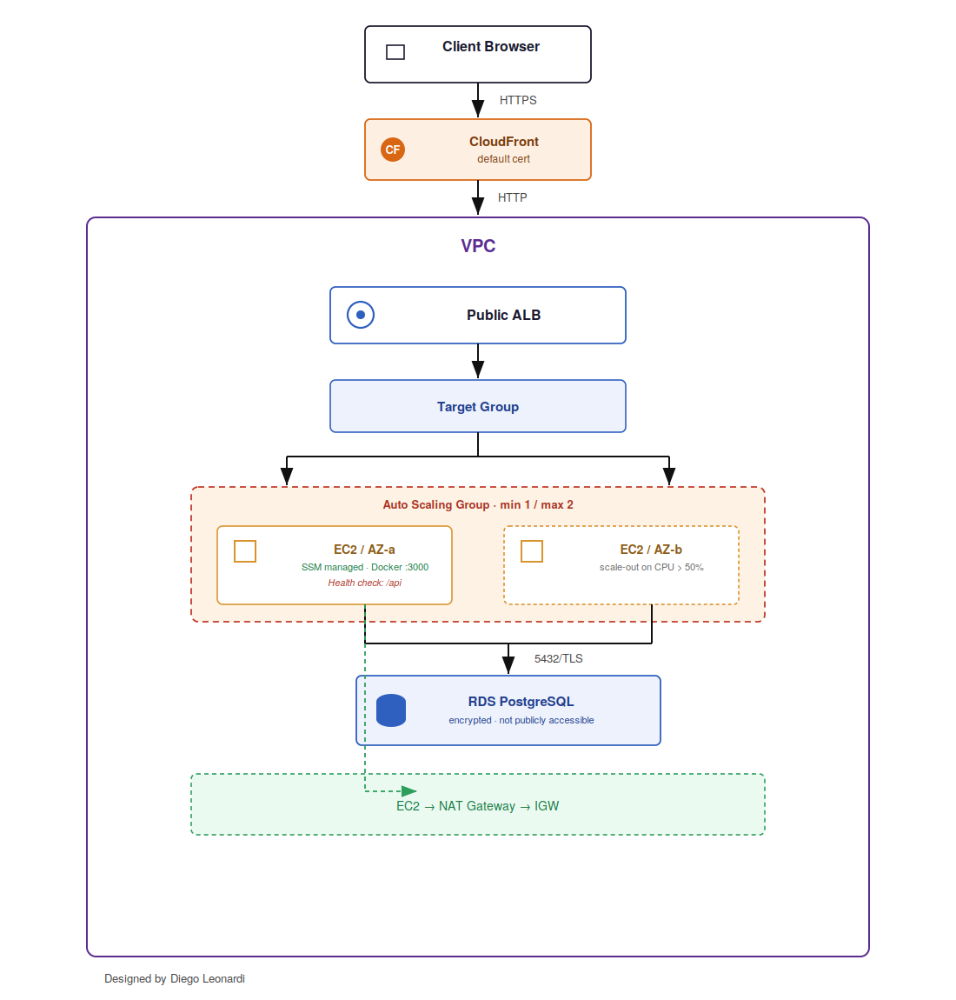
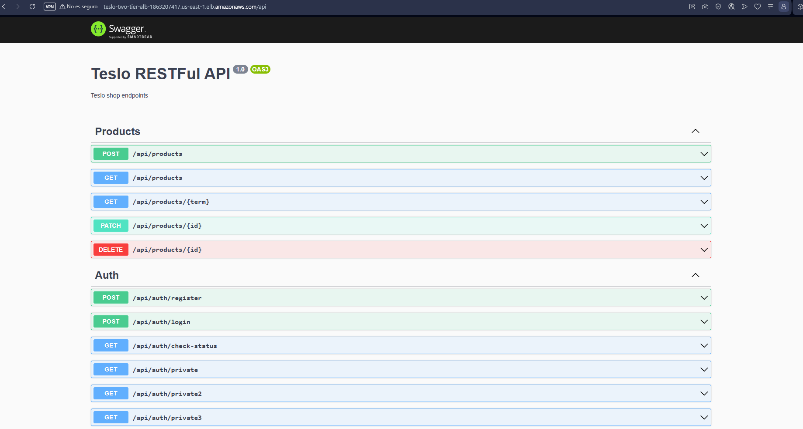

---

## Table of Contents

- [Overview](#overview)
- [Architecture](#architecture)
- [Application](#application)
- [Design Decisions](#design-decisions)
- [Infrastructure as Code](#infrastructure-as-code)
- [CI/CD: Automated Terraform Plan](#cicd-automated-terraform-plan)
- [Deployment](#deployment)
- [Verification](#verification)
- [Debugging Log](#debugging-log)
- [Cost](#cost)
- [Simplifications vs. Full Reference Architecture](#simplifications-vs-full-reference-architecture)
- [Future Improvements](#future-improvements)
- [Lessons Learned](#lessons-learned)

---

## Overview

This project provisions a two-tier AWS architecture — a public tier for internet-facing traffic and a private tier for the application and database — to host **Teslo Shop**, a NestJS + TypeORM + PostgreSQL e-commerce API originally built during Fernando Herrera's Udemy Docker course.

**Stack:** Terraform · AWS (VPC, EC2, RDS, ALB, IAM/SSM) · Docker · NestJS · TypeORM · PostgreSQL

This is a simplified version of [project #11](https://github.com/NotHarshhaa/DevOps-Projects) from NotHarshhaa's DevOps-Projects repo, rebuilt from scratch and deployed end-to-end on a real AWS account — see the [Debugging Log](#debugging-log) for the actual issues found and fixed along the way.

---

## Architecture

- 1 VPC across 2 Availability Zones (`10.0.0.0/16`)
- 2 public subnets (ALB) + 2 private subnets (EC2, RDS)
- 1 Internet Gateway + 1 NAT Gateway
- Layered Security Groups: `Internet → ALB (80/443) → EC2 (from ALB only) → RDS (from EC2 only, port 5432)`
- 1 EC2 (`t3.micro`) running the app in a Docker container, private subnet, **no public IP**
- 1 RDS PostgreSQL 16 (`db.t3.micro`), encrypted at rest, **not publicly accessible**, private subnet
- 1 Application Load Balancer, public subnet
- **27 AWS resources total**, all created and destroyed cleanly via Terraform

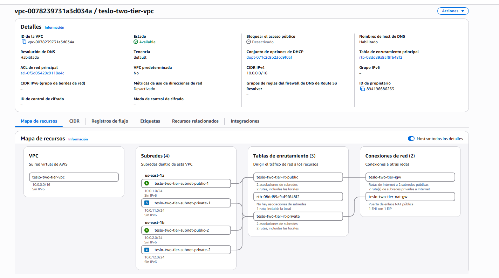

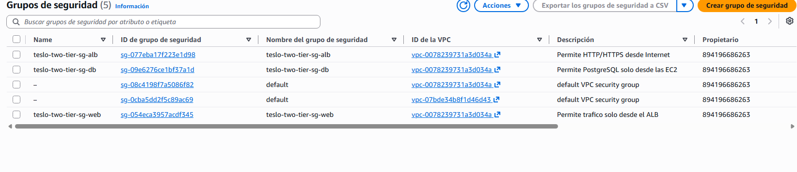

**Security group chain, verified:**

| ALB — open to internet | EC2 — only from ALB | RDS — only from EC2 |
|---|---|---|
| 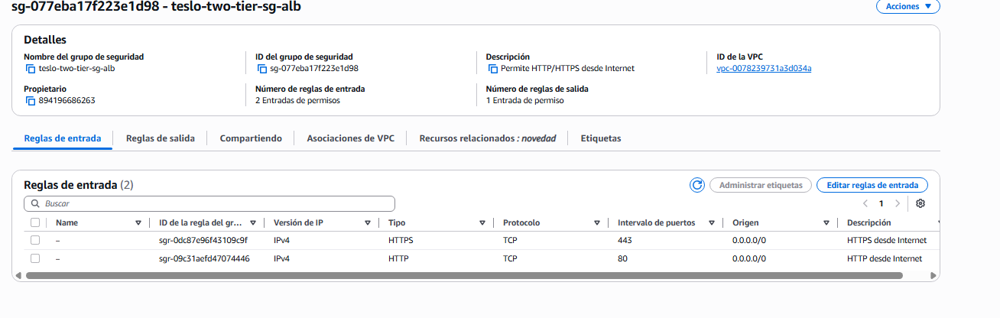 | 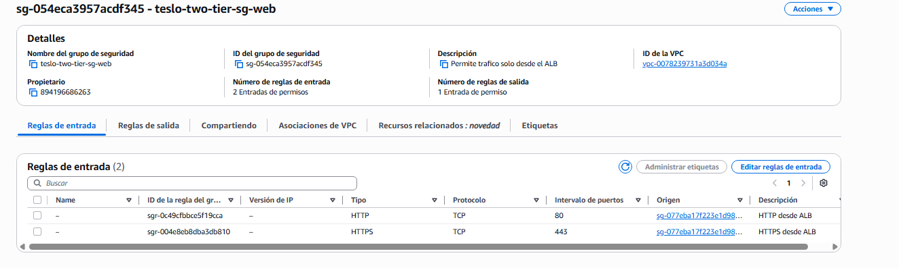 | 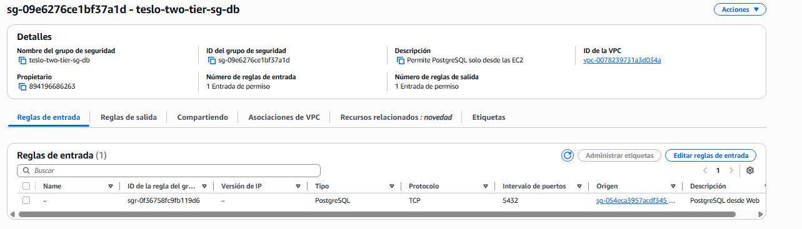 |

---

## Application

**Teslo Shop** is a REST API e-commerce backend (NestJS + TypeORM) built during Fernando Herrera's Udemy course. Chosen over the course's other Docker exercise (`docker-graphql`) specifically because it uses a real relational database — giving the RDS instance in this architecture an actual purpose to validate, rather than sitting idle.

- Docker image: [`diegoleon1982/teslo-shop:latest`](https://hub.docker.com/r/diegoleon1982/teslo-shop)
- Environment variables injected dynamically by Terraform via `user_data`: `DB_HOST`, `DB_PORT`, `DB_NAME`, `DB_USERNAME`, `DB_PASSWORD`, `JWT_SECRET`, `STAGE`, `PORT`
- API prefix: `/api` (Swagger docs served at `/api`)
- SSL to RDS is enabled automatically in the app when `STAGE=prod`

---

## Design Decisions

**Why EC2 and RDS in private subnets, with no public IP?**
The ALB is the only public entry point. This limits the attack surface: even if the ALB's security group were misconfigured, the app server and database still aren't directly reachable from the internet. Confirmed by trying to connect to RDS directly from a local DB client — connection refused, as expected for a resource with no public accessibility.

**Why SSM Session Manager instead of SSH?**
No public IP, no key pair, no port 22 open anywhere. An IAM instance profile with `AmazonSSMManagedInstanceCore` lets me connect through the AWS Console/CLI without opening SSH or managing keys. This turned out to be essential — every bug below was diagnosed live, in production, through an SSM session.

**Why layered Security Groups instead of one shared SG?**
Each tier only accepts traffic from the specific SG in front of it (ALB → EC2 → RDS), not from CIDR ranges. A compromised EC2 instance can't be used to probe RDS from just any private IP — only through this exact chain. Screenshots above confirm the RDS SG's only inbound rule sources from the EC2 SG, not `0.0.0.0/0`.

---

## Infrastructure as Code

```
.
├── main.tf          # VPC, subnets, SGs, RDS, EC2, ALB, IAM/SSM — 27 resources
├── variables.tf      # Input variables with sensible defaults
├── outputs.tf         # ALB DNS name, RDS endpoint, EC2 instance ID, etc.
├── provider.tf         # AWS provider configuration (us-east-1)
└── terraform.tfvars.example   # Copy to terraform.tfvars and fill in your own secrets
```

| Category | Resources |
|---|---|
| Networking | VPC, 4 subnets, IGW, NAT Gateway + EIP, 2 route tables + 4 associations |
| Security | 3 Security Groups (ALB, Web, DB) |
| Compute | 1 EC2 instance, IAM role + instance profile (SSM) |
| Database | 1 RDS PostgreSQL instance, DB subnet group |
| Load Balancing | ALB, target group, listener, target group attachment |
---

## CI/CD: Automated Terraform Plan

As a first step toward full infrastructure automation, this project includes a GitHub Actions workflow (`.github/workflows/terraform.yml`) that automatically runs `terraform fmt`, `validate`, and `plan` on every push to `main`.

- AWS credentials and sensitive Terraform variables (`db_password`, `jwt_secret`) are stored as **GitHub Secrets** — never committed to the repo, never visible in logs.
- `terraform plan` is read-only: the pipeline confirms the plan matches the expected infrastructure (27 resources) without provisioning anything or incurring cost.
- The workflow runs on GitHub-hosted runners, so it needs no local machine or persistent credentials file — `provider.tf` was updated to drop the hardcoded local AWS CLI profile in favor of environment-based credentials, which now works identically both locally and in CI.

**Workflow run, triggered automatically by a push:**
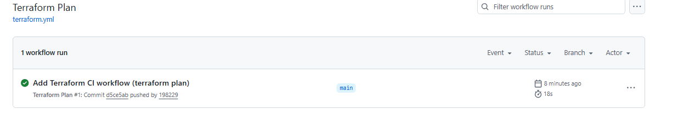

**Plan output, generated entirely by the pipeline:**
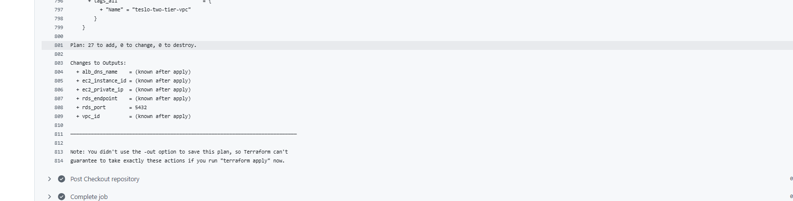

**Next step:** add a manually-triggered (`workflow_dispatch`) `terraform apply` / `terraform destroy` job, so the full infrastructure lifecycle can be demonstrated through the pipeline itself, not just validated.

---
## Getting Started

Want to deploy this yourself? Here's everything you need.

### Prerequisites

- An AWS account with billing enabled
- [Terraform](https://developer.hashicorp.com/terraform/install) >= 1.5
- [AWS CLI](https://aws.amazon.com/cli/) installed and configured with credentials that have permissions to create VPCs, EC2, RDS, ALB, and IAM resources (an IAM user with `AdministratorAccess` is the simplest option for testing)

### Setup

1. **Clone the repo:**
   ```bash
   git clone https://github.com/198229/Teslo-two-tier-aws-terraform.git
   cd Teslo-two-tier-aws-terraform/terraform
   ```

2. **Configure your AWS credentials** (if you haven't already):
   ```bash
   aws configure --profile terraform
   ```

3. **Copy the example variables file and fill in your own values:**
   ```bash
   cp terraform.tfvars.example terraform.tfvars
   ```
   Edit `terraform.tfvars` and set your own `db_password` and `jwt_secret` — never reuse the example values.

4. **Initialize and deploy:**
   ```bash
   terraform init
   terraform validate
   terraform plan
   terraform apply
   ```
   Confirm with `yes` when prompted. RDS typically takes 5–10 minutes to provision — this is expected.

5. **Grab the outputs** once `apply` finishes:
   ```bash
   terraform output
   ```
   Open `http://<alb_dns_name>/api` in your browser to see the Swagger UI.

6. **When you're done, tear it down** to avoid ongoing charges:
   ```bash
   terraform destroy
   ```

### Debugging a running deployment

The EC2 instance has no SSH access by design. To inspect logs or troubleshoot, connect via **SSM Session Manager**:

```bash
aws ssm start-session --target <ec2_instance_id> --profile terraform
```

Once connected:
```bash
sudo docker logs teslo-shop-app --tail 50
```


## Deployment

```bash
terraform init
terraform validate
terraform plan
terraform apply
```

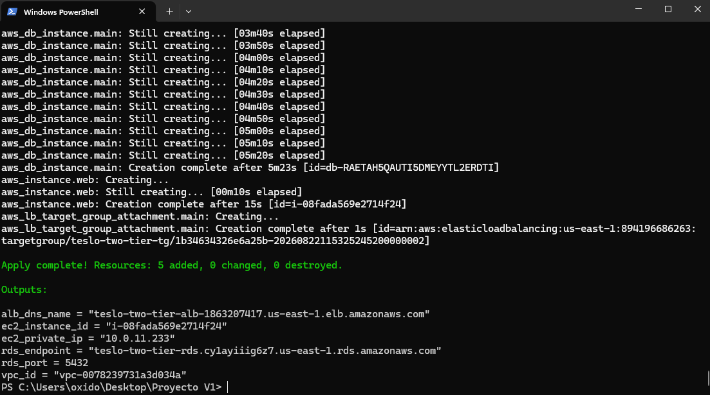

**Outputs:**
```
alb_dns_name    = teslo-two-tier-alb-1863207417.us-east-1.elb.amazonaws.com
ec2_instance_id = i-08fada569e2714f24
ec2_private_ip  = 10.0.11.233
rds_endpoint    = teslo-two-tier-rds.cy1ayiiig6z7.us-east-1.rds.amazonaws.com
rds_port        = 5432
vpc_id          = vpc-0078239731a3d034a
```

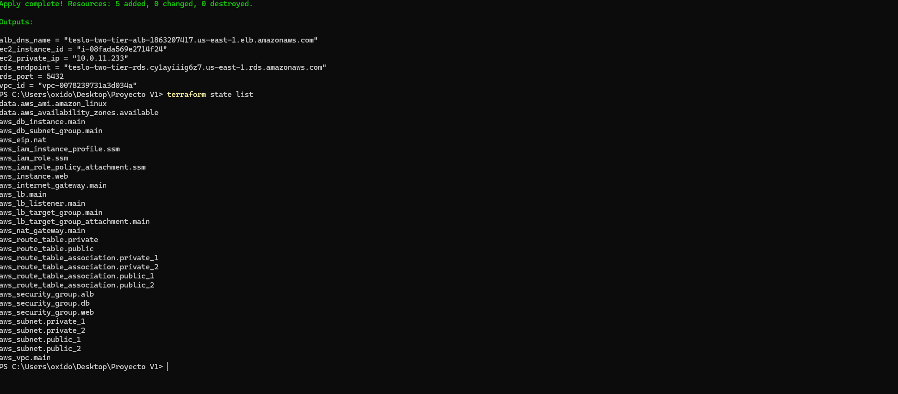

---

## Verification

**EC2 running, no public IP, in the private subnet:**
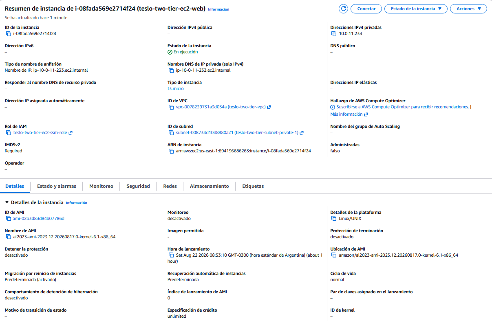

**RDS: available, encrypted, not publicly accessible:**
| Connectivity | Encryption |
|---|---|
| 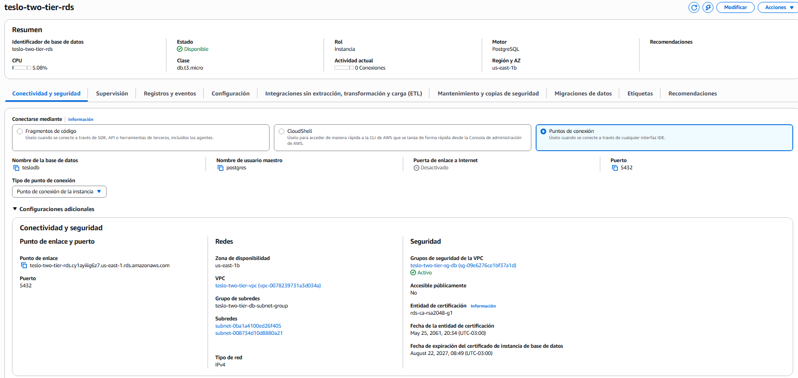 | 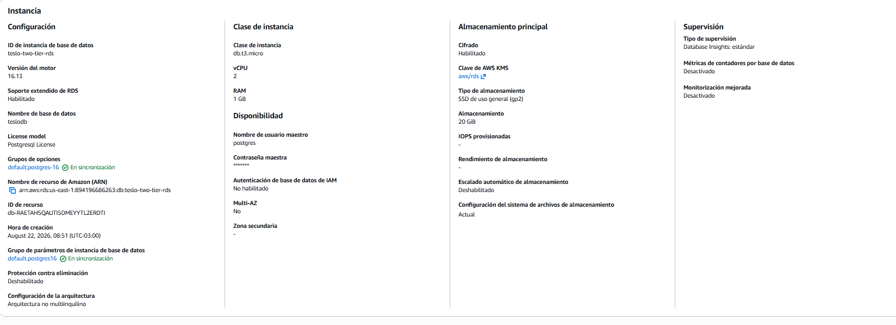 |

**ALB Target Group: EC2 registered and healthy** — confirms the health check on `/api` is working correctly:
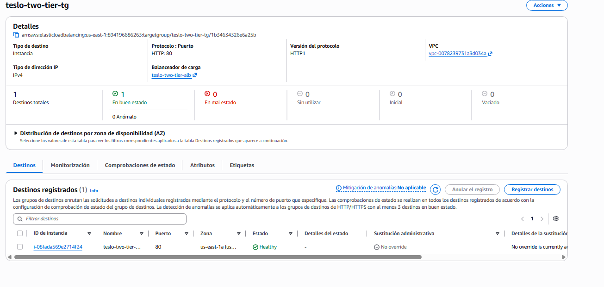

**App reachable through the ALB, serving real seeded data:**
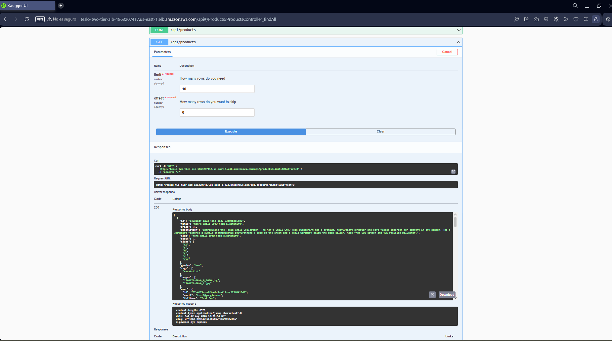

**Direct psql connection from inside the private network, over SSL, confirming TypeORM's `synchronize: true` auto-created the schema:**
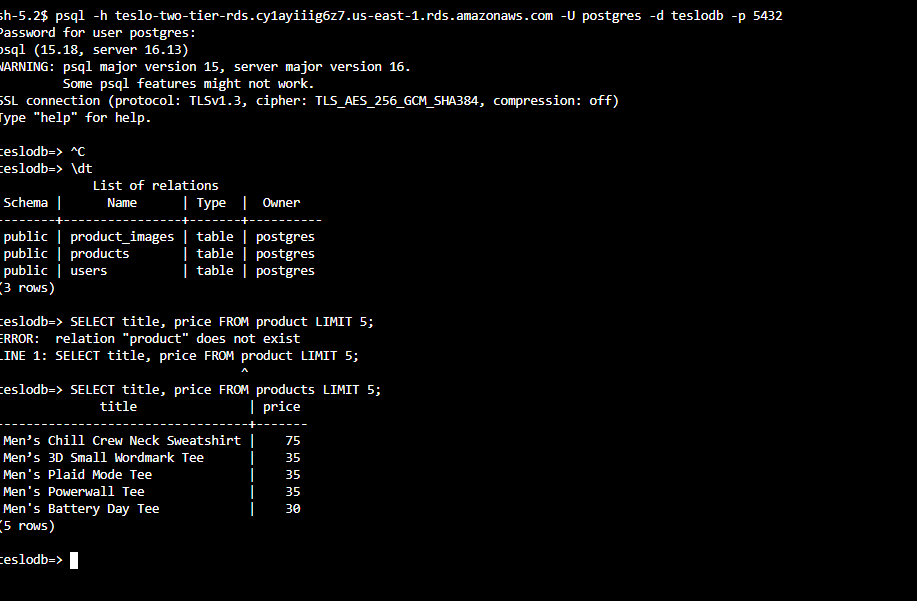

---

## Debugging Log

Everything below was found and fixed against the real, deployed infrastructure — not simulated. This is the part of the project I'd point to first in an interview.

### 1. `GroupDescription` rejected mid-apply: non-ASCII characters
`terraform plan` passed cleanly, but `terraform apply` failed **after** the NAT Gateway and ALB were already created:

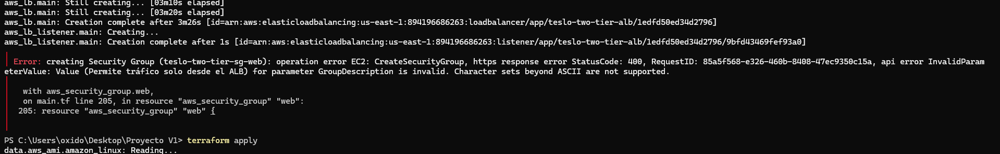

AWS's `CreateSecurityGroup` API rejects accented characters in `GroupDescription`. My original description had a `í` in *"tráfico"*. Fixed by using plain ASCII (`"Permite trafico..."`). Lesson: some validation only happens against the live AWS API, not during `plan`.

### 2. `key_name = ""` broke instance creation
Passing an empty string for `key_name` is not the same as omitting it — AWS tries to look up a key pair literally named `""` and fails. Since this project uses SSM Session Manager exclusively, the fix was to remove the `key_name` argument from the `aws_instance` resource entirely rather than pass an empty value.

### 3. NestJS module version mismatch (`@nestjs/websockets` vs `@nestjs/core`)
The app crashed on boot with:
```
TypeError: this.metadataScanner.getAllMethodNames is not a function
```
`@nestjs/common`, `@nestjs/core`, and `@nestjs/platform-express` were pinned to `^8.0.0` while `@nestjs/websockets`, `@nestjs/typeorm`, `@nestjs/jwt`, and others were on `^9.0.0`. The WebSockets module called an API from a `MetadataScanner` version the pinned core didn't have. **Fixed by aligning the whole NestJS core to `^9.0.0`.**

### 4. TypeORM 0.3.x blocks unconditional `DELETE` — even the `.where('1=1')` workaround
The `/api/seed` endpoint returned `500`, with this in the container logs (read live via SSM):
```
TypeORMError: Empty criteria(s) are not allowed for the delete operation.
```
The seed logic used `.delete().where({}).execute()` to clear tables before reseeding — valid in TypeORM 0.2.x, rejected in 0.3.x. My first fix, `.where('1=1')`, *also* failed with the same error. Reading TypeORM's own source directly inside the running container settled it:
```bash
sudo docker exec teslo-shop-app grep -rn "Empty criteria" /app/node_modules/typeorm/
```
This version of TypeORM explicitly detects and blocks the `"1=1"` trick — it checks the built WHERE expression, not just whether `.where()` was called. The library's own error message spelled out the real fix: *"build the query without one to intentionally affect all rows."* Removing `.where(...)` entirely resolved it.

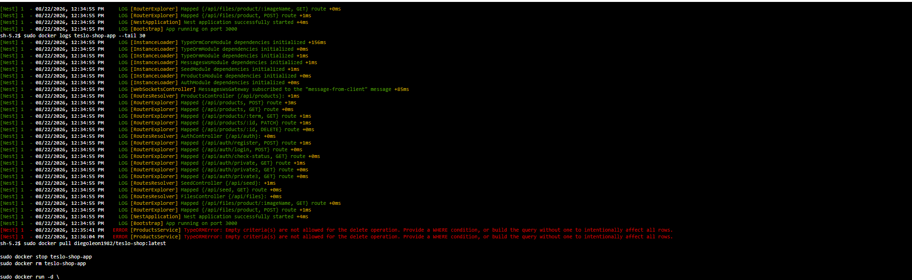

---

## Cost

This project is designed to run for a few hours at a time and then be destroyed — not left running.

| Resource | Approx. hourly cost |
|---|---|
| EC2 t3.micro | ~$0.0104/hr |
| RDS db.t3.micro | ~$0.017/hr |
| NAT Gateway | ~$0.045/hr + data processing |
| ALB | ~$0.0225/hr + LCU |

**Actual cost of this project's full test cycle (apply → verify → seed → destroy):**

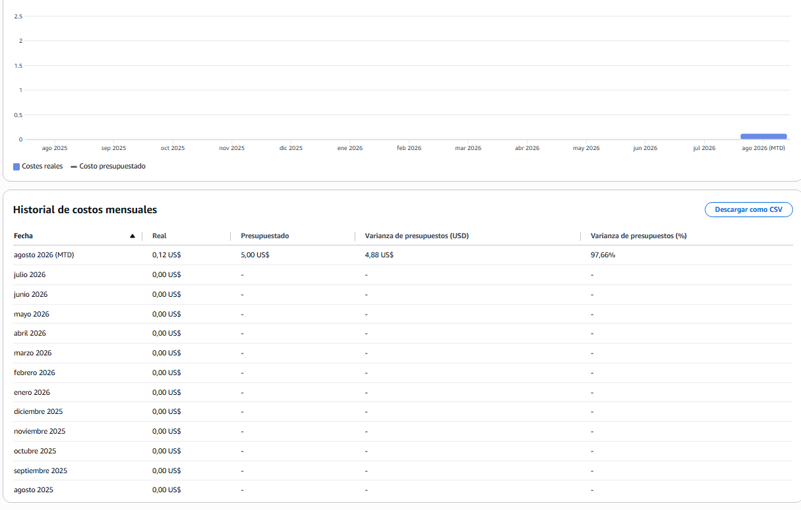

```bash
terraform destroy
```

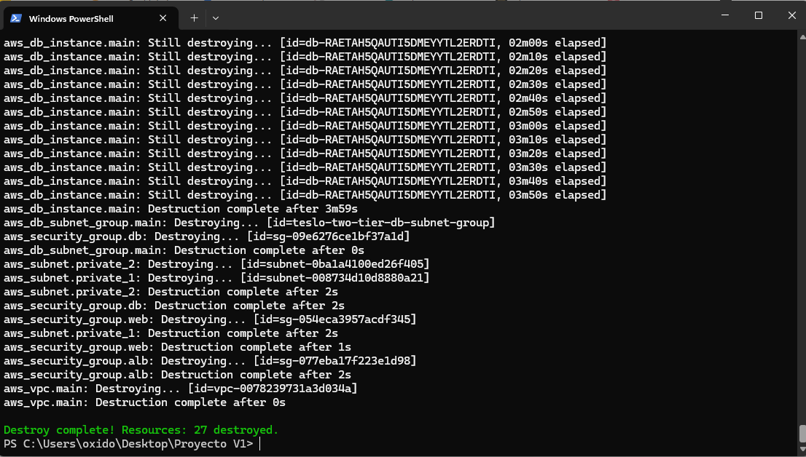

---

## Simplifications vs. Full Reference Architecture

This project is a simplified version of [project #11](https://github.com/NotHarshhaa/DevOps-Projects) from NotHarshhaa's DevOps-Projects repo, scoped down deliberately to stay focused and cheap to iterate on:

| Full reference architecture | This project |
|---|---|
| Auto Scaling Group | Single EC2 instance |
| Multi-AZ RDS | Single-AZ RDS |
| CloudFront + WAF | Direct ALB, no CDN/WAF |
| Likely ECR | Docker Hub |

---

## Future Improvements

- [ ] Migrate the image from Docker Hub to Amazon ECR
- [ ] Add a CI/CD pipeline (GitHub Actions) to build and push the Teslo Shop image automatically on every commit
- [ ] v2: Auto Scaling Group across multiple instances
- [ ] v2: CloudFront distribution in front of the ALB
- [ ] Move secrets (`DB_PASSWORD`, `JWT_SECRET`) out of EC2 `user_data` and into AWS Secrets Manager, fetched by the container at startup instead of injected as plaintext env vars
- [ ] Add a `wait-for-it` style healthcheck directly in the Dockerfile `HEALTHCHECK` instruction
- [ ] Add a manually-triggered `terraform apply`/`destroy` workflow to demonstrate full CI/CD-managed deployment

---

## Lessons Learned

- **`terraform plan` doesn't catch everything.** The ASCII character issue only surfaced mid-`apply`, after real (billable) resources had already been created. Always budget time for apply-time failures, not just plan-time ones.
- **Version pinning across a framework's own sub-packages matters as much as pinning the framework itself.** The NestJS websockets crash wasn't caused by an outdated dependency in the traditional sense — every package was a "valid" semver range, they just didn't agree with each other.
- **When a library's error message tells you the fix, trust it literally before getting clever.** My first instinct (`.where('1=1')`) was a workaround for the symptom; the actual library had already anticipated that exact workaround and blocked it. Reading the dependency's source directly, inside the running container, resolved it faster than more trial and error would have.
- **SSM Session Manager isn't just a "nice to have" for a private-subnet EC2 — it's how every one of these bugs actually got diagnosed**, live, with real logs, without ever opening port 22.

---

## Tech Stack

`Terraform` `AWS` `Docker` `NestJS` `TypeORM` `PostgreSQL` `VPC` `EC2` `RDS` `ALB` `IAM` `SSM`
